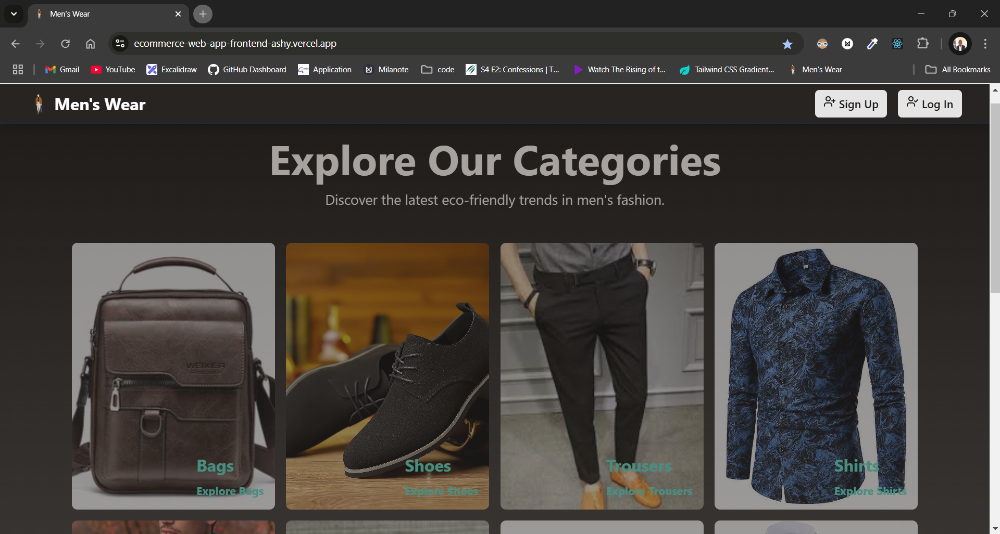

# #Men's Wear Ecommerce

- web application for an ecommerce store selling men's wear.

## Table of Contents

- Getting Started
- Features
- Technologies Used
- Directory Structure
- API Documentation
- Contributing
  -License

## Getting Started

To get started with this project, follow these steps:

- Clone the repository: git clone https://github.com/your-username/mens-wear-ecommerce-store.git
- Install dependencies: npm install or yarn install
- Start the development server: npm run dev or yarn dev
- Open your web browser and navigate to http://localhost:3000

## Features

- User authentication and authorization
- Product catalog with filtering and sorting
- Shopping cart and checkout functionality
- Payment processing using Stripe
- Admin dashboard for managing products and orders

## Technologies Used

- Frontend: React, React Router, Zustand, Tailwind CSS
- Backend: [backend code](https://github.com/Chinokoo/ecommerce-web-app)
- APIs: Stripe for payment processing

## Directory Structure

- src/: Source code for the application
- components/: React components
- pages/: React pages
- store/: zustand store
- public/: Static assets

## API Documentation

- coming soon

## Contributing

- Contributions are welcome! Please submit a pull request with a clear description of the changes.

## License

This project is licensed under the MIT License. See [LICENSE](https://opensource.org/license/mit) for details.
